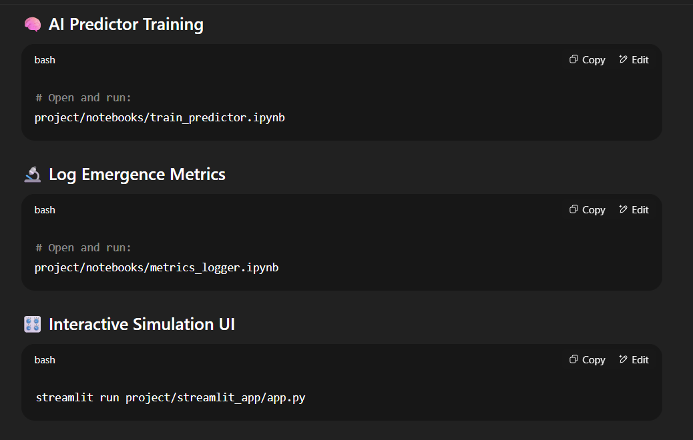

# 🌌 Physics Simulator - Streamlit App

A real-time interactive physics simulation with emergent behaviors, featuring multiple physics rules including diffusion, explosions, chaos, and reaction-diffusion patterns.

## 🚀 Features

- **Interactive Controls**: Real-time parameter adjustment
- **Multiple Physics Rules**: Diffusion, explosions, chaos, and reaction-diffusion
- **Visual Analytics**: Live visualization of emergence metrics
- **AI Predictor**: Neural network trained on simulation data
- **Metrics Logging**: Track entropy, energy, and anomaly patterns

## 🎮 Try It Live

**[Launch the App](https://your-app-url.streamlit.app)** *(will be updated after deployment)*

## 📊 What It Does

This simulator demonstrates emergent physics behaviors through:

1. **Diffusion**: Energy spreads and decays across the grid
2. **Explosions**: Threshold-based energy bursts
3. **Chaos**: Random perturbations create complex patterns
4. **Reaction-Diffusion**: Gray-Scott model approximation for pattern formation

## 🛠️ Local Development

### Prerequisites
- Python 3.8+
- pip or conda

### Installation
```bash
git clone https://github.com/yourusername/physics-simulator.git
cd physics-simulator
pip install -r requirements.txt
```

### Run Locally
```bash
streamlit run streamlit_app.py
```

### Run Notebooks
```bash
jupyter notebook notebooks/train_predictor.ipynb
jupyter notebook notebooks/metrics_logger.ipynb
```

## 📁 Project Structure

```
physics-simulator/
├── streamlit_app.py              # Main Streamlit app
├── emergent_simulator.py         # Core simulation engine
├── requirements.txt              # Dependencies
├── README.md                     # This file
├── notebooks/                    # Jupyter notebooks
│   ├── train_predictor.ipynb     # AI training
│   └── metrics_logger.ipynb      # Metrics analysis
├── assets/                       # Images and resources
├── metrics/                      # Generated metrics data
└── models/                       # Trained AI models
```

## 🎯 Parameters

- **Diffusion Decay**: Controls energy spread rate (0.8-1.0)
- **Explosion Threshold**: Energy level triggering explosions (10-200)
- **Chaos Factor**: Amount of randomness (0.0-1.0)
- **Simulation Steps**: Duration of simulation (50-500)

## 🔬 Science Behind It

The simulator implements several physical and mathematical concepts:

- **Diffusion Equations**: Heat/energy distribution
- **Cellular Automata**: Grid-based rule systems
- **Reaction-Diffusion**: Pattern formation in nature
- **Chaos Theory**: Sensitivity to initial conditions
- **Neural Networks**: Pattern prediction and learning

## 🤖 AI Component

The project includes a PyTorch-based neural network that:
- Learns from simulation sequences
- Predicts next states from current patterns
- Demonstrates emergent behavior learning

## 📈 Metrics & Analytics

Track emergence through:
- **Entropy**: System disorder/randomness
- **Energy**: Total system energy
- **Anomaly**: Pattern deviation (standard deviation)

## 🎨 Visualization

- Real-time heatmaps with multiple colormaps
- Evolution timeline with frame scrubbing
- Dual-panel view (combined + reaction-diffusion)
- Progress tracking and performance metrics

## 🔧 Technical Details

- **Frontend**: Streamlit for interactive web interface
- **Backend**: NumPy for numerical computations
- **AI**: PyTorch for neural network training
- **Visualization**: Matplotlib for plotting
- **Data**: Pandas for metrics handling

## 🌟 Future Enhancements

- 3D visualization support
- More physics rules (fluid dynamics, gravity)
- Real-time parameter evolution
- Multi-agent systems
- WebGL acceleration
- Custom rule creation interface

## 📝 License

MIT License - feel free to use and modify!

## 👨‍💻 Author

Built with ❤️ for exploring emergent systems and complex behaviors.

---

*"Simple rules can create complex, beautiful, and unexpected behaviors."*

## Project Modules

### 1. `emergent_simulator.py`

* Core rule engine (diffusion, chaos, explosions, reaction-diffusion)
* Modular rules
* AI predictor class using CNN

### 2. `train_predictor.ipynb`

* Generates simulation sequences
* Trains a PyTorch CNN to predict the next frame
* Plots training loss

### 3. `metrics_logger.ipynb`

* Logs entropy, energy, and anomaly of system per frame
* Outputs CSV and plots

### 4. `streamlit_app/app.py`

* Streamlit interface with sliders
* Run simulation in-browser with real-time parameters

## Installation

```bash
pip install numpy matplotlib torch pandas streamlit
```

## Run the Simulator UI


```bash
streamlit run project/streamlit_app/app.py
```

## Output

* Real-time visualizations
* AI prediction (PyTorch)
* Metric CSV logs

## Future Work

* Add 3D grid engine
* Extend AI to forecast multiple steps
* Add real-world analogies (fluid dynamics, population models)

## Author

Built by Divyansh Nagar, for research, education, and showcasing computational emergence in physical systems.
